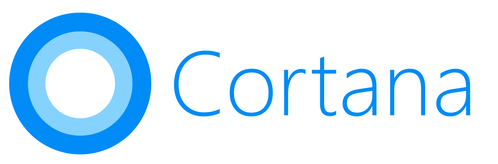

This project aims to re-create the Cortana virtual assistant application bundled with Windows 10 versions prior to August 11, 2023.

---

## Legal & Attribution
Training and model file for "Hey Cortana" wake word provided by [OpenWakeWord](https://github.com/dscripka/openWakeWord)

This is **NOT Cortana**. The program is intended only to resemble and behave like Cortana. I do not claim to own or possess the source code of the original Cortana, nor do I claim to own the copyright.

Microsoft Corporation are the legal owners of Cortana's name and image. They were not involved in any sense, in the creation of this program.

No generative AI has been used in the creation of this program.